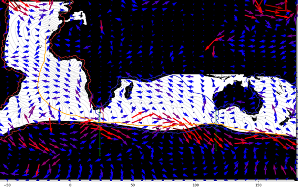
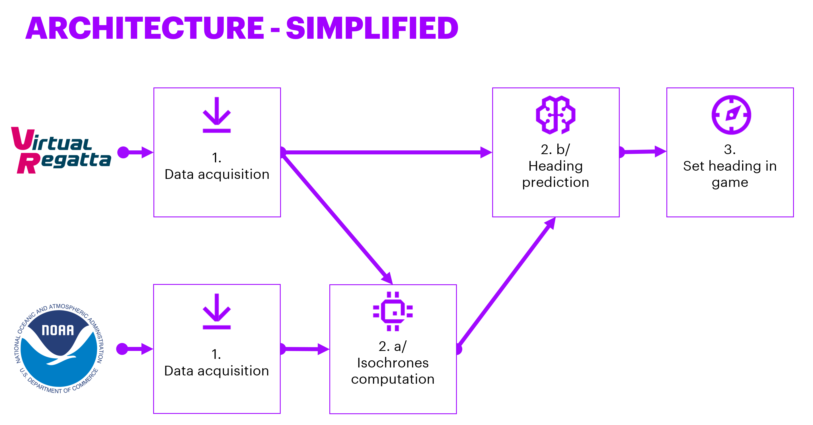
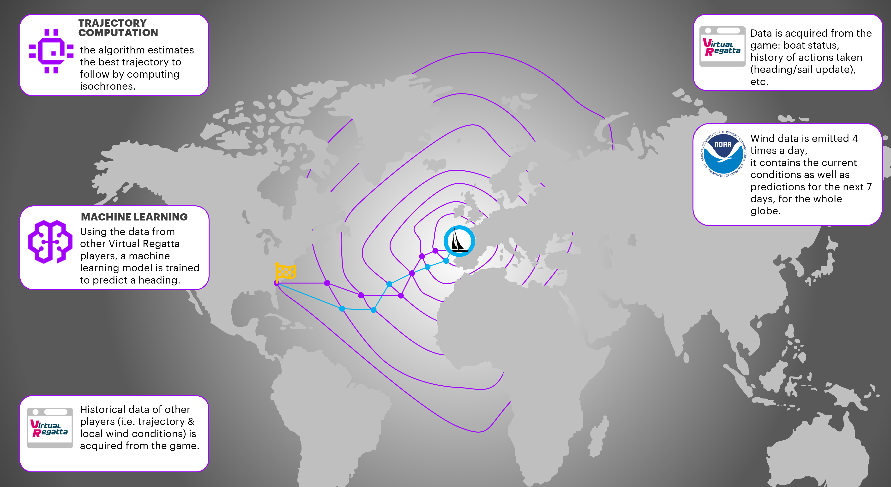

# Roboat - Virtual Regatta

Repo structure:
- **isochrones:**  
A complex (algorithm/code-wise) engine to predict an optimal route between a starting point and en ending point (more accurately a finish line).



The engine is exposed as a Flask service, and used to be deployed as an Elastic Beanstalk app. It is linked to AWS (S3) as it reads input data (wind) and writes output predictions.

- **lambda_functions:**   
A series of (AWS) lambda functions. The most useful ones for the 2022 challenge would be:
  - vr_parse_wnd (parse .WND files into .CSV)
  - vr_get_fleet (get info about a set of boats using VR API)
  - vr_predict_heading (calls the Machine Learning model to predict the boat's heading)
  - vr_isos_supervisions (uses SVM to verify that an isochrones prediction is consistent with the previous calculations)

- **sagemaker_notebooks:**  
A set of Jupyter notebooks used to pre-process race data, train the ML model & process geospatial data (map).

## The first Roboat - Vendée Globe approach





## 2022 challenge - what code artifacts could be useful?

| **Artifact** | **Language** | **Notes**                                                                                                                                     |
| --- | --- |-----------------------------------------------------------------------------------------------------------------------------------------------|
| Conversion .WND -> .CSV | Snippet Python |                                                                                                                                               |
| Moteur isochrones (guidage macro) | Python, web service Flask | Strong coupling with AWS (read/write S3), however we implemented a standalone version that should work without AWS |
| Guidage micro | Jupyter notebooks pour le nettoyage des données et l’entraînement | Code not very «clean». Strong coupling with AWS for training (models exposed via Sagemaker)                                                   |
| Combinaison guidage macro & micro | Python (fonction lambda) | Tightly coupled with AWS (it consists of a lambda function + a call to a Sagemaker endpoint)                                                  |
| Supervision guidage macro | Python | uses SVM to verify that an isochrones prediction is consistent with the previous calculations. Tightly coupled with AWS (lambda function + S3) |

## Maintenance

### General guidelines

- Create a new branch per new feature (main is usually the most up-to-date)

- Before requesting a Pull Request, make sure the reference branch (likely to be main) did not diverge:

```bash
git checkout main
git pull
git checkout YOUR_FEATURE_BRANCH
git merge main
```

- Fix any conflicts, push the merge commit, and create the pull request

### Python-related (isochrones, lambda_function, sagemaker_notebooks)

- If you update the packages list, make sure to update the requirements file accordingly. The best way to do so is to use pipenv for your local environnement:

```bash
pipenv install my_package
pipenv lock -r > requirements.txt
```

- Also update the third party licenses files (cf. <https://github.com/ftpsolutions/python-third-party-license-file-generator>):

```text
rm THIRDPARTYLICENSES_summary
python -m third_party_license_file_generator -r requirements.txt -p $(which python) -g -c >> THIRDPARTYLICENSES_summary
```

(Remove the options -g -c if you want to get an error message for GPL/commercial licenses detected)

- Document! And update this Readme :)

### Troubleshooting

#### Git LFS
You may need to use git-lfs to retrieve some large data files from this
repository. Check this link for installation steps: https://git-lfs.github.com/.  
Once installed, you can use this command to pull the files
```
git lfs pull
```
