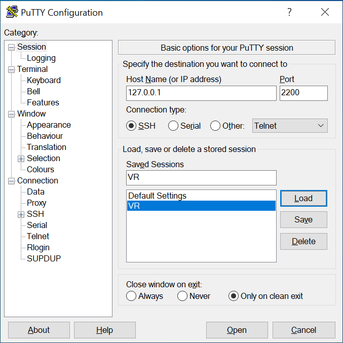
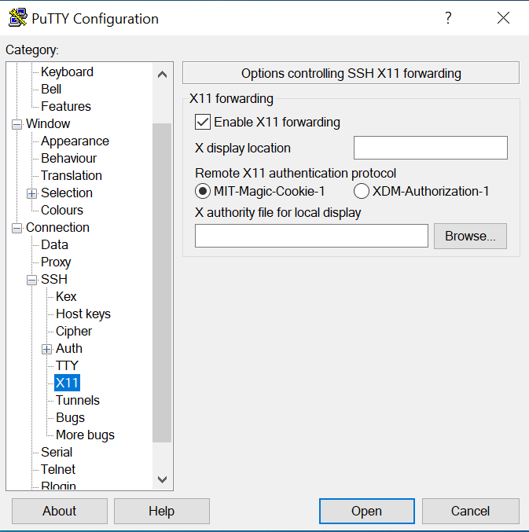

# Virtual Regatta: Isochrone solver files

This folder holds all the code related to isochrones computation for the Virtual Regatta project.

Folder structure:
    data: legacy folder
    out: might be legacy too
    src: the code
        common: files containing methods used by different part of the stack
        core: the core iscochrones implementation
        isochrones_API: a layer on top of the core implementation + supporting & test files
        net_cdf: legacy
        wnd_wrapper: legacy, code stransfered to a lambda function
    test_api: a folder used to store wind data files when testing the code locally
    worldarrays: the world map

## Installation

### Using pipenv?

Recommanded: use pipenv <https://pipenv.pypa.io/en/latest/>

Install using pip:

```cmd
pip install --user pipenv
```

Then install the libraries needed:

```cmd
pipenv install -d
```

Activate the environment:

```cmd
pipenv shell
```

For Windows Users :

```cmd
pip install --user pipenv
```

Set to PATH in th environement variables:

```cmd
C:\Users\<User>\AppData\Roaming\Python\Python36\Scripts
```

### Using pip?

```cmd
pip install -r requirements.txt
```

## Usage

### Standalone

Two files can be used as entry points. Preferred option:
    src/isochrones_API/isochroneVR_API_test.py
or (not maintained):
    src/core/isochroneVR.py

The first option will trigger isochrones calculation using one of the input specified in:
    src/isochrones_API/payload.py

Once the calculation starts, a window should pop-up with the world's map (or a part of it), and isochrones should start showing up.
To customize the testing:
    1. Update the payload.py file (start point, end point, intermediate objectives, wind path, delta hours, constrain radius, etc.). Either create a new variable or update an existing one
    2. Import and use the variable in src/isochrones_API/isochroneVR_API_test.py (lines 7 and 28)
    3. Specify if you want to download and process wind data in src/isochrones_API/isochroneVR_API_test.py (lines 31 and 32)
    4. Specify some specific map bounds in src/isochrones_API/isochroneVR_API_test.py (lines 16 to 20)

### Flask web service

1. Run the Flask web service: ```python application.py```
2. Send a POST request to ```127.0.0.1:5000/compute_full_isos``` (update the IP as needed), with a JSON-formatted body (replicate one of the variables in src/isochrones_API/payload.py)

Check if the web service is up: ```GET 127.0.0.1:5000 (no body)```

Check the running threads: ```GET 127.0.0.1:5000/check_threads```

## Deployment

This application is currently deployed as an Elastic Beanstalk service in AWS.

To update the deployment:

1. Install & configure the AWS CLI
2. Install the EB CLI
3. eb deploy

.ebignore file can be updated to exclude files not needed before the upload.

## Maintenance

Update the requirements file with pipenv:
    pipenv run pip freeze > requirements.txt

## Troubleshooting

### WSL
If you use WSL, you may need to follow below steps to run the code in standalone mode.
1. Install a X11 server in Windows to support GUI apps, for instance Xming:

    <http://www.straightrunning.com/XmingNotes/>

    <https://sourceforge.net/projects/xming/>  


2. Install Putty

    <https://www.putty.org/>  

3. Start SSH server on WSL & verify if it's running:

    ```cmd
    sudo service ssh start
    sudo service ssh status
    ```

    You may need to update the SSH server config:

    ```cmd
    cd /etc/ssh
    sudo nano sshd_config
    ```

    For instance, consider using another port than 22:

    ```text
    Port 2200
    ```
   
    Change also the **PasswordAuthentication** parameter and put it to yes in order
    to connect with the user/password you specified when installing and configuring Linux with WSL.
    ```text
    PasswordAuthentication yes
    ```

4. Append your .bashrc file

```cmd
nano ~/.bashrc
# X11 server
```

```text
export DISPLAY=localhost:10.0
export LIBGL_ALWAYS_INDIRECT=1
```

5. SSH into the VM and enable X11 forwarding (with Putty) & launch Xming.  
**Putty Configuration**  
- First you'll need to configure the Session part in Putty. 
Click on **Session** then enter the localhost address **(127.0.0.1)**
then the port you specified in your sshd_config (see next step).


- Then you'll need to check **Enable X11 forwarding** box under **Connection ->
SSH**



- You can save your configuration and click on **Open** to open
the connection.
### Homebrew/Linuxbrew specific steps

Either find a version of Python in your OS that includes Tkinter, or build Python from source with some special parameters to make sure Tkinter is included.

To build Python from source:
Start by installing some packages that Python should pick up at build time (not sure all are required, but at least bz2 for Pandas) (cf. <https://stackoverflow.com/questions/51149227/correctly-building-local-python3-with-bz2-support>):

```cmd
sudo apt-get install libbluetooth-dev libbz2-dev libdb-dev libexpat1-dev libffi-dev libgdbm-dev liblzma-dev libmpdec-dev libncursesw5-dev libreadline-dev libsqlite3-dev libssl-dev zlib1g-dev
```

Install tkinter support (cf. <https://discourse.brew.sh/t/python3-installation-with-tkinter/3636/3>):

Mac Os version
```cmd
brew install tcl-tk
```

Linux version
```cmd
apt-get install python3-tk
```

Install pyenv (cf. <https://hackernoon.com/reaching-python-development-nirvana-bb5692adf30c>):

```cmd
brew install pyenv
echo 'eval "$(pyenv init -)"' >> ~/.profile
```

Build Python from source with some specific arguments (to support Tkinter) (cf. <https://stackoverflow.com/questions/60469202/unable-to-install-tkinter-with-pyenv-pythons-on-macos/60469203#60469203>):

```cmd
env PATH="$(brew --prefix tcl-tk)/bin:$PATH" LDFLAGS="-L$(brew --prefix tcl-tk)/lib" CPPFLAGS="-I$(brew --prefix tcl-tk)/include" PKG_CONFIG_PATH="$(brew --prefix tcl-tk)/lib/pkgconfig" CFLAGS="-I$(brew --prefix tcl-tk)/include" PYTHON_CONFIGURE_OPTS="--with-tcltk-includes='-I$(brew --prefix tcl-tk)/include' --with-tcltk-libs='-L$(brew --prefix tcl-tk)/lib -ltcl8.6 -ltk8.6'" pyenv install 3.8.1
```

Set the global Python version:

```cmd
pyenv global 3.8.1
```

Test (a window should popup):

```cmd
python -m tkinter
```

Specify the version of Python to use when setting up your pipenv environnement (make sure which python outputs the Python verison installed with pyenv):

```cmd
pipenv --python=`which python`
```

Resume with the installation section
